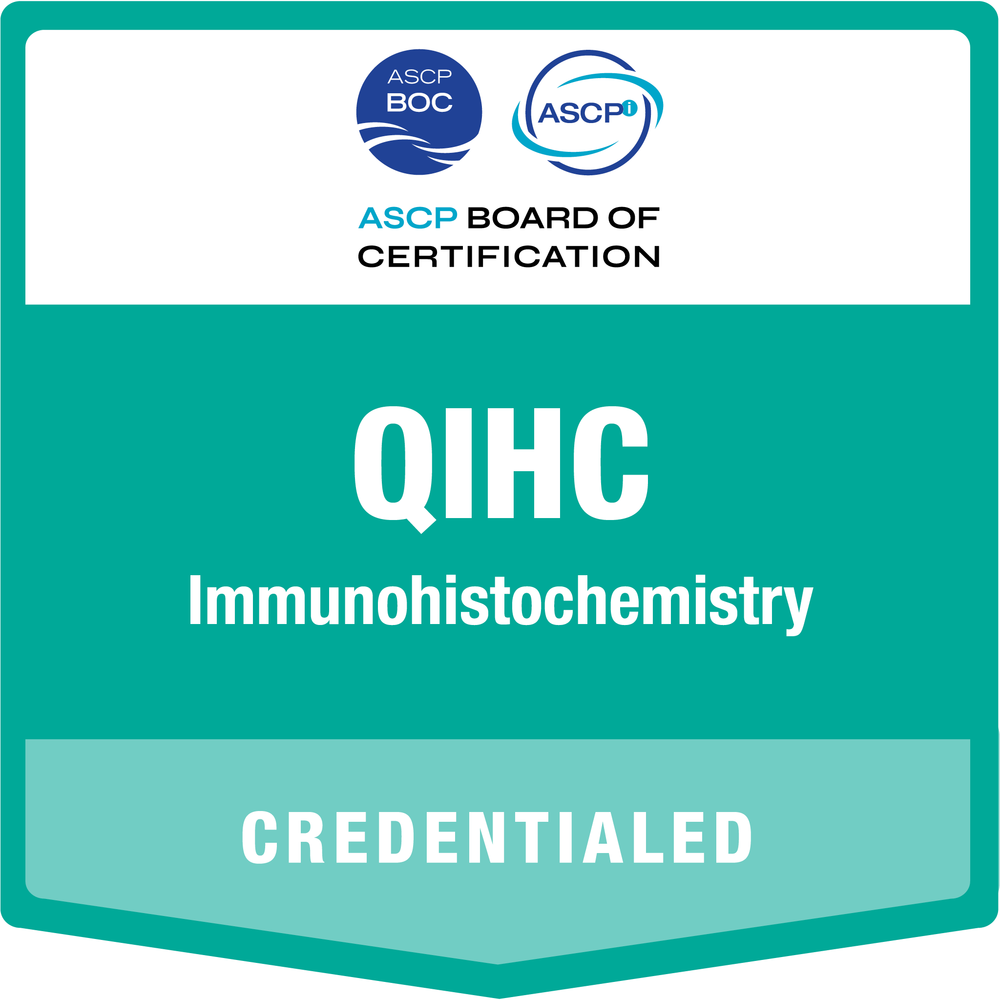

<p align="center">
  
</p>

<h1 align="center">Edward J. Edmonds</h1>

<p align="center"><em>Adaptive systems · Essential fatty acid biochemistry · Hormetic endocrinology</em></p>

For more than twenty years my work was to make tissue legible—to fix, cut, and stain it so
that what mattered could be seen. Which is really to say I spent two decades learning how
easily observation can be manufactured, and what it takes to trust what you see.

Histotechnology is a discipline of preparation. Nothing under the microscope is raw; every
image is the product of how the sample was fixed, processed, and stained. A careless step
upstream produces an artifact that looks exactly like a finding. So the first thing the work
teaches is a specific, durable skepticism: *before asking what a result means, ask how it was
made.* That question—is this signal, or an artifact of the method?—is the one I bring to
almost everything I read now.

The bench trains other habits alongside it. Judging a preparation is its own kind of pattern
recognition—not reading a slide for a diagnosis, but reading it for fidelity: is this section
adequate, did the stain perform, is that structure real or an edge of the knife, a fold, a
precipitate? Immunohistochemistry is an education in evidence itself—in controls, in
specificity and sensitivity, in the discipline of proving that a marker marks what you claim
before anyone should believe it. And troubleshooting reveals cause the hard way: isolate the
variable, change one thing, watch what moves.

Because tissue only makes sense across scales—a molecule, a membrane, a cell, an organ, a
body—the work is inherently systems thinking. You cannot make sense of a morphology, or of
why a stain behaves as it does, without moving up and down those levels at once. That
instinct, more than any particular fact, is what the essays here are built from.

What I offer, then, is less a list of topics than a way of working: rigorous observation,
respect for method, mechanism over correlation, and a refusal to mistake a compelling story
for a demonstrated one. The person who prepares the evidence learns better than anyone how
easily it can be made to lie. Twenty years as a scientist in histotechnology taught me to look closer,
question assumptions, and find the signal in the noise—and I write to do the same with the
literature.

## Credentials

- **HT(ASCP)<sup>CM</sup>** — Histotechnician, American Society for Clinical Pathology
- **QIHC<sup>CM</sup>** — Qualification in Immunohistochemistry (ASCP)
- Trained at the Tri-Service School of Histotechnology, Armed Forces Institute of Pathology

<p>
  <a href="https://www.credly.com/badges/98b44cdc-b993-4f95-8ba0-56fb2e000c00/public_url" title="Verify HT(ASCP) — Histotechnician on Credly"></a>
  <a href="https://www.credly.com/badges/46a2f830-ffc3-4f1c-9568-129cdf914d2f/public_url" title="Verify QIHC — Qualification in Immunohistochemistry on Credly"></a>
</p>

## Contact

The best way to reach me is the [contact page](https://edwardjedmonds.com/contact/). My work and the
source for this site live on [GitHub](https://github.com/deths74r).

---

# edwardjedmonds.com

The public archive — evergreen essays and reference articles on physiology, nutrition
science, lipid metabolism, and pathology. Built with [Hugo](https://gohugo.io) and deployed
to GitHub Pages. The newsletter (Buttondown) is the separate, subscriber-facing channel.

## Writing workflow

```
read papers → take notes → write Markdown → commit → auto-publish
```

Everything lives in this repo as portable Markdown. There is no external theme — all
layouts and styles are in `layouts/` and `assets/`, so nothing can rot or go unmaintained.

## Local preview

Requires **Hugo extended ≥ 0.164** (`hugo version` should say `+extended`).

```sh
hugo server -D      # live preview at http://localhost:1313 (-D shows drafts)
```

**Search** is built by [Pagefind](https://pagefind.app) from the *rendered* site, so it
doesn't run under `hugo server`. To preview it, build and index, then serve the output:

```sh
hugo --minify && npx -y pagefind@1.5.2 --site public && python3 -m http.server -d public 1313
```

In CI this runs automatically (a Pagefind step after the Hugo build in the deploy workflow).

## Creating content

```sh
hugo new content essays/my-new-essay.md       # long-form essay
hugo new content concepts/oxidative-stress.md # short reference article
hugo new content notes/reading-2026-07.md     # short research note
```

New files start with `draft: true`. Set it to `false` (or delete the line) to publish.

### Front matter options

| Field         | Purpose                                                        |
|---------------|----------------------------------------------------------------|
| `title`       | Article title                                                  |
| `date`        | Publish date (controls ordering)                               |
| `description` | One–two sentences; used for SEO, social cards, and list blurbs |
| `tags`        | Topic tags for clustering, e.g. `["lipids", "history of science"]` |
| `math: true`  | Load KaTeX on this page (only when you use math)               |
| `toc: true`   | Show a table of contents (good for long essays)                |
| `draft: true` | Hide from the built site until ready                           |

### Formatting cheatsheet

- **Footnotes:** `some claim.[^1]` … then `[^1]: the citation.`
- **Math:** inline `\( E = mc^2 \)`, display `$$ ... $$` (needs `math: true`).
- **Figures:** drop images in `static/figures/`, then
  ``
  (`class="numbered"` auto-numbers the caption "Figure 1.", "Figure 2.", …).
- **Cross-links:** `[lipid peroxidation]()`.

## Structure

```
content/essays/     long-form essays
content/concepts/   short reference articles (SEO-facing)
content/notes/      short research notes
static/figures/     images and diagrams
layouts/            HTML templates (the "theme")
assets/css/         styles
```

## Deployment

Pushing to `main` triggers `.github/workflows/deploy.yml`, which builds with Hugo and
publishes to GitHub Pages. One-time setup: **Settings → Pages → Source → GitHub Actions**.

## Custom domain

The site is live at **[edwardjedmonds.com](https://edwardjedmonds.com/)** over HTTPS. The setup:

- `static/CNAME` contains `edwardjedmonds.com`; `baseURL` in `hugo.toml` is `https://edwardjedmonds.com/`.
- DNS (at Squarespace) points the apex at GitHub Pages via the four `A` records plus `AAAA` records.
- **Settings → Pages** has the custom domain set with **Enforce HTTPS** enabled.

`www` is not configured — add a `www` CNAME to `deths74r.github.io` if you ever want it.

## Known dependency: KaTeX

Math is rendered by KaTeX loaded from a CDN, and only on pages that set `math: true`. For a
fully offline-durable archive you can self-host KaTeX by vendoring its CSS/JS/fonts into
`static/` and updating `layouts/partials/head.html`. Everything else has zero runtime
dependencies.
